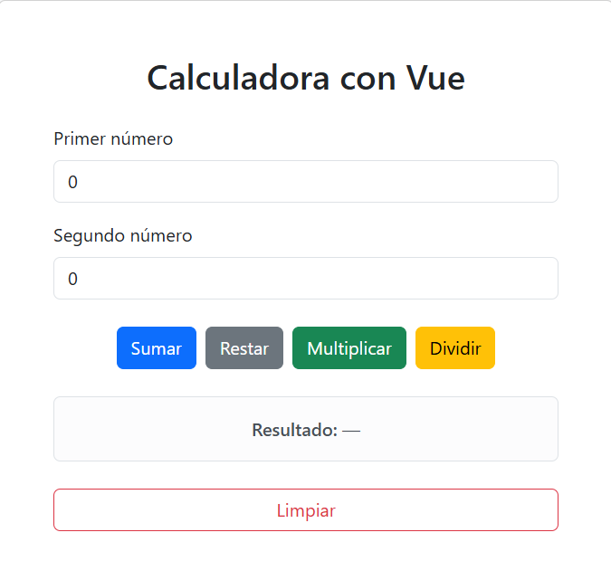

# Calculadora con Vue

Aplicación web de calculadora creada con Vue 3 y Bootstrap 5. Permite realizar las cuatro operaciones aritméticas básicas desde una interfaz simple, accesible y adaptable a distintos tamaños de pantalla.



## Funcionalidades

- Suma, resta, multiplicación y división de números enteros o decimales.
- Admite números negativos.
- Muestra un mensaje cuando faltan valores o se ingresan datos no numéricos.
- Evita la división por cero.
- Permite limpiar los campos y el resultado con un solo botón.
- Comunica resultados y errores mediante atributos de accesibilidad.

## Requisitos

- [Node.js](https://nodejs.org/) 18 o una versión posterior.
- npm, incluido con Node.js.

## Instalación y ejecución

```bash
npm install
npm run dev
```

El comando iniciará el servidor de desarrollo. Abre la dirección que aparezca en la terminal, normalmente `http://localhost:8080`.

También puedes usar el alias:

```bash
npm run serve
```

## Uso

1. Escribe el primer y el segundo número.
2. Selecciona **Sumar**, **Restar**, **Multiplicar** o **Dividir**.
3. Consulta el resultado mostrado debajo de los botones.
4. Usa **Limpiar** para restablecer los valores iniciales.

Si intentas dividir por cero o falta algún valor, la aplicación mostrará un mensaje explicando el problema.

## Scripts disponibles

| Comando | Descripción |
| --- | --- |
| `npm run dev` | Inicia el servidor de desarrollo con recarga automática. |
| `npm run serve` | Alias para iniciar el servidor de desarrollo. |
| `npm run test` | Ejecuta las pruebas de la lógica de cálculo. |
| `npm run lint` | Revisa el código con ESLint. |
| `npm run build` | Genera la versión optimizada para producción en `dist/`. |

## Pruebas

```bash
npm run test
```

Las pruebas cubren las cuatro operaciones básicas, números decimales y negativos, valores vacíos o inválidos, y la división por cero.

## Estructura del proyecto

```text
src/
├── App.vue             # Interfaz, estado y eventos de la calculadora
├── calculator.mjs      # Operaciones y reglas de validación
└── main.js             # Punto de entrada de Vue
test/
└── calculator.test.mjs # Pruebas automatizadas de la lógica
public/
└── calculadora-vue.png # Captura mostrada en este README
```

## Tecnologías

- [Vue 3](https://vuejs.org/)
- [Bootstrap 5](https://getbootstrap.com/)
- [Vue CLI](https://cli.vuejs.org/)
- [Node.js Test Runner](https://nodejs.org/api/test.html)
